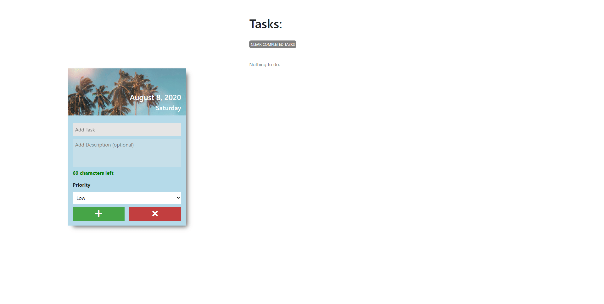

# To-Do-List-App

Created a simple To-Do List App using HTML, CSS, and Vanilla JS. 
This is the project I did after learning the fundamentals of JavaScript. This demonstrates my knowledge on:
* DOM manipulation
* Event binding and handling
* Looping through a Nodelist
* Object creation through a constructor
* Built-in JS objects

### Features of the To-Do List App:
1. Displays current time and date. The background image of the date and time changes depending on the current season.
2. Enables user to add more details on the task card. The user can enter a description up to a specific number of characters.
3. User can put a priority tag on the task card - low (default), medium, and high.
4. User can removes a task card.
5. If task is completed, it is placed at the end of the list of task cards.
6. User can remove all the completed task cards.

### Future improvements:
1. Enable user to edit task cards once it is created.
2. Filter settings to only show cards of a specific priority.
3. Search task cards.

## DEMO

